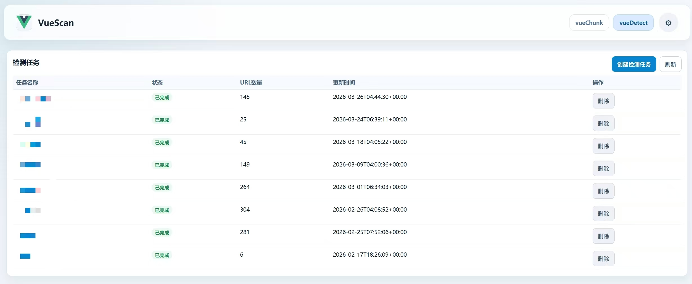
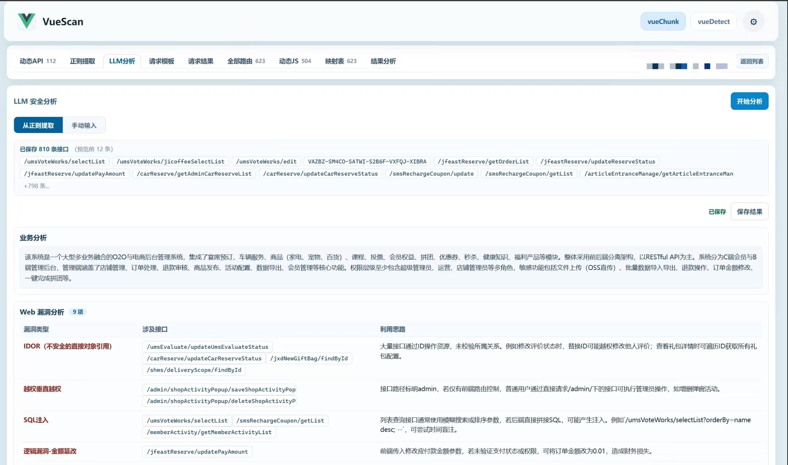
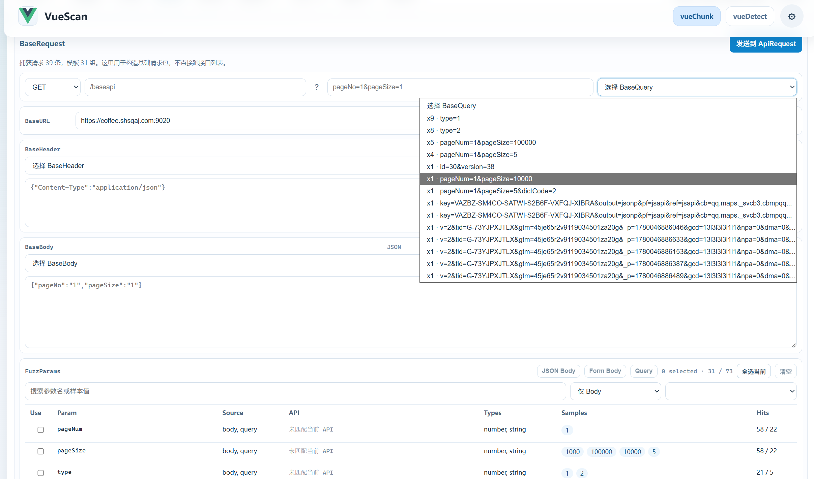
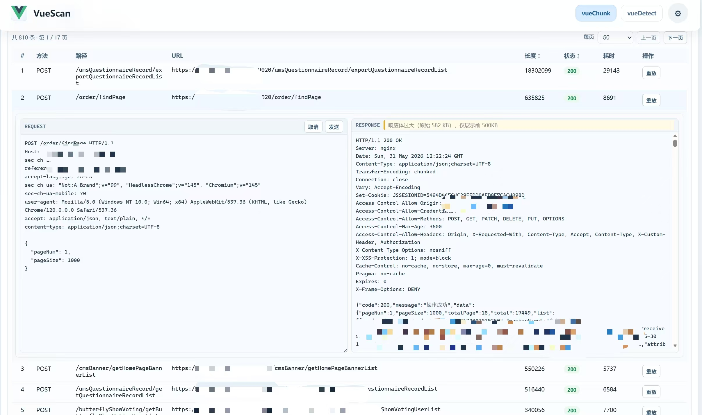
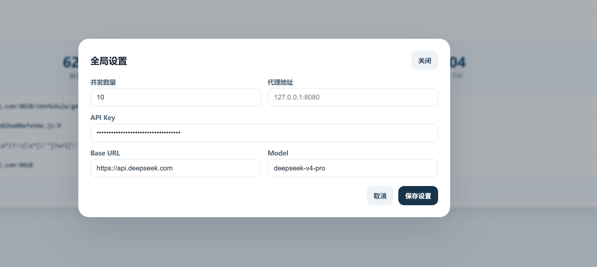

# VueScan

针对 Vue SPA 应用的自动化资产分析与 API 探测平台。覆盖从站点识别、路由捕获、JS 代码分析、接口提取，到请求构造、批量发送、安全分析的完整链路。LLM 贯穿多个关键节点：正则自动生成、BaseURL 推断、接口安全分析报告（漏洞识别 / 未授权建议 / 攻击链推演）。


---

## 架构

```
VueDetect                  VueChunk
    │                          │
    │  批量识别 Vue 站点          │  单项目深度分析
    │                          │
    ▼                          ▼
┌─-───-─────┐         ┌────────────────────────────────-──────────┐
│  资产列表  │         │                  分析流水线                │
│  导入/排序 │         │                                           │
└─-───-─────┘         │  路由访问 → 请求捕获 → Locate JS → 正则提取 │
                      │      → BaseURL 推断 → 参数生成 → 批量请求   │
                      └────────────────────────────────-──────────┘
                                        │
                              ┌─────────┴─────────┐
                              │                   │
                         LLM 分析              Repeater
                         安全报告              原始报文重放
```

---

## 模块

### VueDetect

批量处理 URL 资产，识别 Vue SPA 站点。

- 支持 `xlsx / txt / html` 格式导入
- 自动按路由数量排序，高价值目标前置
- 批量并发探测，过滤非 Vue 站点



---

### VueChunk

单项目完整分析流水线。

#### 路由捕获

- Playwright 驱动，自动访问所有路由
- 实时拦截并记录 `路由 → API → Chunk JS` 完整链路
- 支持手动 / 自动两种模式


#### JS 分析与 API 提取

- 批量下载 Chunk JS 到本地
- **Locate JS** — 将每条 API 精确映射到源文件及行号
- **LLM 正则生成** — 基于代码上下文自动生成提取正则，批量收集 API 端点
- **BaseURL / BaseAPI 自动推断** — 分析请求样本，输出可用配置


---

### LLM 分析

将提取的接口列表提交 LLM，生成结构化安全分析报告。

| 分析项 | 内容 |
|--------|------|
| 业务分析 | 接口功能及业务逻辑梳理 |
| Web 漏洞分析 | 注入、越权、信息泄露等风险及涉及接口 |
| 未授权建议 | 疑似未鉴权接口列表及风险说明 |
| 接口分析 | 每条 API 业务含义 + 攻击思路 |
| 攻击链 | 多接口组合攻击路径推演 |

- 支持**项目接口**（正则提取结果）和**手动输入**两种来源
- 接口路径支持**一键复制**到剪贴板



---

### BaseRequest

请求基础配置层，统一管理公共参数。

| 字段 | 说明 |
|------|------|
| BaseURL | 目标服务器地址 |
| BaseAPI | 接口路径前缀 |
| BaseQuery | 公共 Query 参数 |
| BaseHeader | 公共请求头 |
| BaseBody | POST 请求 Body 模板 |
| FuzzParams | Query / JSON / Form 参数模糊生成 |



---

### ApiRequest

基于 BaseRequest 配置的批量请求执行层。

- 批量发送全部提取接口，结果自动保存为可切换快照
- 顶部快照选择栏（当前 / 第一次 / 第二次…）支持多轮结果对比
- 实时搜索过滤接口路径 / URL / 方法



#### Repeater

内置原始报文重放工具。

- 点击「重放」打开左右分栏视图
- 左侧：可编辑的原始 HTTP 请求（`GET /path HTTP/1.1` 格式）
- 右侧：响应原始报文，发送后实时更新
- 编辑器在发送后保持打开，支持连续修改重发
- 展开行只读视图显示最后一次发送的请求 + 响应


---

### 分析仪表盘

项目级扫描结果汇总，单页呈现关键指标。

- 优先级评级（高 / 中 / 低）及判断依据
- 路由数、JS 文件数、已下载 Chunk、请求快照数、已保存结果
- 扫描配置：BaseURL、BaseAPI、正则、定位文件
- 最佳响应概览


---

## 自动化流水线

启用全自动模式后，系统对单个项目依次执行：

```
1. 访问并归一化目标路由 URL
2. 拦截捕获 API 请求 + Chunk JS 资源
3. Locate JS，定位 API 源码位置
4. LLM 生成正则，批量提取 API 端点
5. 推断 BaseURL / BaseAPI 配置
6. 构造 GET BaseRequest，批量执行请求 → 保存快照①
7. 构造 POST BaseRequest，批量执行请求 → 保存快照②
8. 生成项目价值评分及 LLM 安全分析报告
```

---

## 安装

**环境要求**

- Python 3.10+
- Node.js 18+

```bash
pip install -r requirements.txt
python -m playwright install chromium

cd frontend && npm install && npm run build && cd ..
```

**启动**

```bash
python vs.py
# 访问 http://127.0.0.1:8000
```

首次访问进入初始化页面，设置管理员账号密码后登录。

**LLM 配置**

在应用全局设置中填写兼容 OpenAI 格式的 API Key 及 Base URL（支持 OpenAI、DeepSeek 等）。



---


